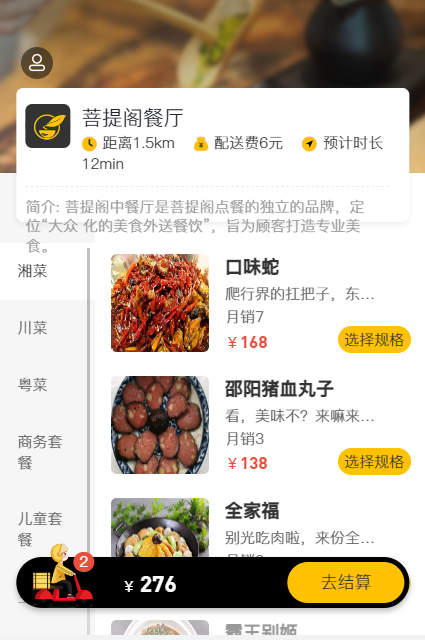

# reggie_take_out

### 1. 介绍

该项目为黑马程序员项目《瑞吉外卖》 [点击跳转项目教程](https://www.bilibili.com/video/BV13a411q753/?spm_id_from=333.337.search-card.all.click&vd_source=eb3ce27642efcc6516cfe22b34da20c0)，后端使用` springboot` + `mybatis plus` + `redis` 开发，前端使用 `element-ui`组件开发。仓库前端代码由课程资料提供，个人仅作稍微改动，后端是我跟着视频慢慢撸出的，自己有另外实现部分功能，如：图片上传、定时清理缓存图片，以及完成课程剩余未实现内容。

### 2. 界面展示

后台登陆页面：


前台登陆页面：




大体上页面效果与课程一样，客户端个人中心做了改动，如下：


### 3. 图片存储

我采用的是七牛云存储图片，需配置好七牛云存储空间 及设置 cdn 加速域名。

不知道怎么配置七牛云的可以参考我的博文：[七牛云搭配 PicGo 配置图床](https://www.jishuqin.cn/2023/02/18/%E4%B8%83%E7%89%9B%E4%BA%91%E6%90%AD%E9%85%8DPicGo%E9%85%8D%E7%BD%AE%E5%9B%BE%E5%BA%8A/)

图片的上传、删除 封装在工具类 `QiniuUtils`,需设置你自己的`accessKey`、`secretKey`、`bucket`、设置存储空间区域编号。

修改`front\js\common.js`和`backend\js\common.js`中图片前缀：


### 4. 短信验证码

短信验证码服务使用的是阿里云的，须在工具类`AliyunSmsUtils`中填入`accessKeyId`、`accessKeySecret`,如下设置即可发送验证码，注意：需申请短信签名和短信模板。

```java
AliyunSmsUtils.sendMessage("短信签名名称","短信模板CODE",phone,code);
```

